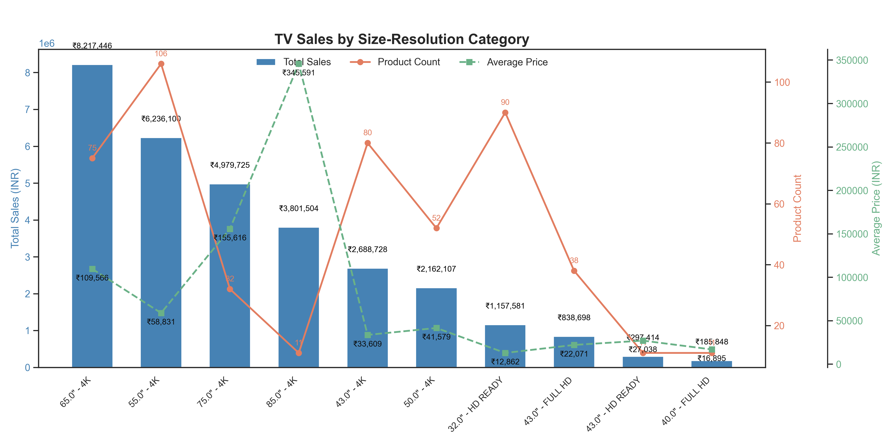

# 📊 Exploratory Data Analysis: JioMart TV & Projector Market

## 🗂️ Project Overview
This project is an end-to-end exploratory data analysis of over 700 TV and projector products listed on **JioMart**, one of India’s leading e-commerce platforms. The goal was to extract insights about pricing trends, resolution types, brand market shares, and screen size categories by transforming unstructured listings into structured data.

---

## 🚀 Key Highlights
- 🔍 **Data Cleaning:** Removed noise, extracted structured fields from titles, and cleaned price/screen size columns.
- 🧠 **Feature Engineering:** Created new features like `Screen Size`, `Resolution`, and `Brand` using regex parsing.
- 📈 **Visualization:** Used `Matplotlib` and `Seaborn` to analyze market trends, price distributions, and brand dominance.
- 📊 **Market Insights:** Found that 65" 4K TVs dominate revenue, Full HD/HD Ready TVs lead in units, and Sony has the highest average price.

---

## 📁 Project Structure

```bash
JioMart_TVs_Project/
├── Data_cleaning_viz/
│   ├── [Data_Filtering_tvs_projectors.ipynb](Data_cleaning_viz/Data_Filtering_tvs_projectors.ipynb)
│   ├── [DATA_VISUALIZATION_JIO_PROJECTORS.ipynb](Data_cleaning_viz/DATA_VISUALIZATION_JIO_PROJECTORS.ipynb)
│   └── [Data_viz_jio_tvs.ipynb](Data_cleaning_viz/Data_viz_jio_tvs.ipynb)
├── plots/
│   └── 📊 PNG visualizations (see samples below)
├── Webscraping/
│   ├── jiomart_pw.py
│   ├── jiomart.py
│   └── jiomartsavetocsv.py
├── [jiomart_tvs_projectors_combined_final.csv](jiomart_tvs_projectors_combined_final.csv)
└── readme.md
```

---

## 📊 Sample Visuals

### 🔸 TV Sales by Category



## 📌 Key Insights
- 📺 **4K TVs** dominate premium price segments; 65" 4K drives the highest revenue.
- 🏷️ **Sony** has the highest average price per product.
- 📉 Budget segments are saturated with **Full HD** and **HD Ready** models.
- 📊 Strong positive correlation between **screen size** and **price**.

---

## 🧰 Tech Stack
- **Python 3.x**
- **Pandas**, **NumPy**
- **Matplotlib**, **Seaborn**
- **Jupyter Notebook**
- **Regex** for parsing unstructured titles

---

> 🤖 Built with the help of intelligent scraping, data wrangling, and visualization tools.
